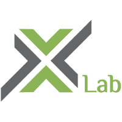

# GPU-accelerated Algorithms for Solving Linear Systems

## Introduction

GPU-accelerated algorithms for solving large sparse linear algebraic equations using C++ language, implementing *Jacobi Method*, *Gauss—Seidel Method*, *Successive Over-Relaxation (SOR) Method*, *Steepest Descent Algorithm*, and *Conjugate Gradient Method*. Among these, we also implemented *Jacobi Method* and *Steepest Descent Algorithm* using Nvidia CUDA API to accelerate these algorithms.

It is a collaborative, interdisciplinary project drawing on expertise from School of Software Engineering and College of Civil Engineering, Tongji University, Shanghai.

## Getting Started

### Environment Requirements

- NVIDIA Graphics Card (Support at least versions after CUDA 10.0)
- Microsoft Windows 10 (NVIDIA has ceased CUDA driver support for Apple MacOS X)
- Microsoft Visual Studio (Special support for CUDA application)

### Get the Project

- Get the source code from GitHub

    > git clone [https://github.com/1751200/Xlab-k8s-gpu.git](https://github.com/1751200/Xlab-k8s-gpu.git)

### Import the Project to IDE

**TODO**: (How to import the project into IDE)

### Build the Project

**TODO**: (How to build executable artifacts.)

## Running the Project

**TODO**: (Describing how to startup the project)

## Project Functionalities

**TODO**: (Basic operations of the project)

## Documentation

We use **GitHub Wiki** for organizing documentation. For the documentation available, see the [homepage](https://github.com/1751200/Xlab-k8s-gpu/wiki) of our Wiki.

## Code Structure

```
.
├── CudaTest			# Solve large matrix multiplication using CUDA API
├── IterativeMethod             # Jacobi & Gradient Descent Iterative Method
├── LICENSE			# MIT License
├── PythonVersion		# Solve large matrix multiplication using python libararies
├── README.md			# README file
├── ReadFile			# Read the xxx.stiff file for the matrix input
├── cuBLAS			# Solve large matrix multiplication using cuBLAS API
└── images			# images for documentation
```

## License

This project is licensed under the Apache2.0 License - see the [LICENSE.md](https://github.com/1751200/Xlab-k8s-gpu/blob/master/LICENSE) file for details.

