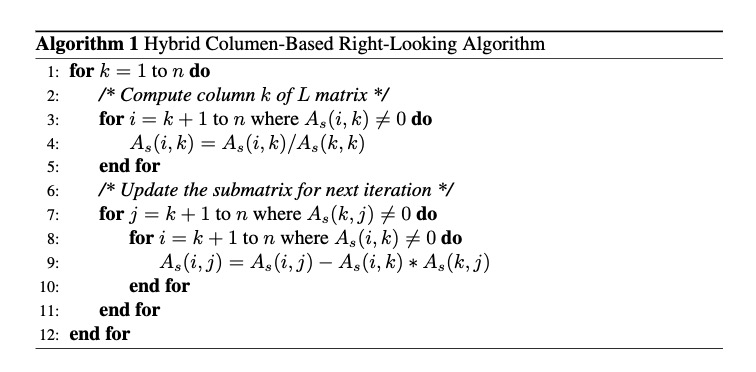

# 几种常用线性方程组的直接解法探究

[TOC]

求解线性方程组的方法分为**直接法**和**迭代法**两大类。迭代法采取逐次逼近的方法，从一个初始解出发，按照一定的计算格式，构造一个向量的无穷序列，其极限是方程组的精确解。但在上学期关于迭代法的研究与开发的过程中，系数矩阵的条件数、非零元素分布特征等因素对求解迭代次数的影响很大，相同维度的线性方程组的迭代次数可能是几次、几十次，也有可能是上万次。虽然直接法需要的计算量比较大，一般为方程组维数的三次方，但直接法的**计算量相对稳定**，不会出现迭代法中可能出现的远超方程组维数的三次方的计算量。因此，直接法求解线性方程组也十分具有研究价值。首先我们主要讨论一些最基本的直接法，并在此基础上讨论他们的各种改进以及矩阵分解的一些概念。

## 1 高斯消元法

### 1.1 定义

​	高斯消元法主要通过系数矩阵行向量加减消元，产生一个行阶梯形矩阵，通过行阶梯形矩阵的最后一行的等式，求解一个未知量，并不断向上回代求解，直到求解出所有变量。

### 1.2 限制条件

​	由于系数矩阵的所有主元 $a_{ii}^{(i)}$ 在消元时都会被当作除数，因此必须满足系数矩阵的所有主元 $a_{ii}^{(i)} \neq 0$。

### 1.3 计算过程

​	考虑 $n$ 阶线性方程组
$$
A x=b
$$
系数矩阵为 $\boldsymbol{A}=\left(a_{i j}\right)_{n \times n}$， 右端向量和精确解分别为 $\boldsymbol{b}=\left(b_{1}, b_{2}, \cdots, b_{n}\right)^{\mathrm{T}}$， $\boldsymbol{x}=\left(x_{1}, x_{2}, \cdots，x_{n}\right)^{\mathrm{T}}$, 它的分量形式为
$$
\left\{\begin{array}{c}
a_{11} x_{1}+a_{12} x_{1}+\cdots+a_{1 n} x_{n}=b_{1} \\
a_{21} x_{1}+a_{22} x_{1}+\cdots+a_{2 n} x_{n}=b_{2} \\
\vdots \\
a_{n 1} x_{1}+a_{n 2} x_{1}+\cdots+a_{n n} x_{n}=b_{n}
\end{array}\right.
$$
用高斯消元法求解上述线性方程组的计算过程如下：

​	分别记矩阵 $\boldsymbol{A}^{(1)}=\boldsymbol{A}$，向量 $\boldsymbol{b}^{(1)}=\boldsymbol{b}$，它们的元素分别为
$$
a_{i j}^{(1)}=a_{i j}, \quad b_{i}^{(1)}=b_{i} \quad(i, j=1,2, \cdots, n)
$$

1. 消元过程

    第一步，如果 $a_{11}^{(1)} \neq 0$，可对 $i=2,3,...,n$ 做如下的运算，用数 $m_{i 1}=-a_{i 1}^{(1)} / a_{11}^{(1)}$ 依次乘以方程组的第一行，并加到第 $i$ 行上去，可得到
    $$
    \left(\begin{array}{ccccc}
    a_{11}^{(1)} & a_{12}^{(1)} & a_{13}^{(1)} & \cdots & a_{1 n}^{(1)} \\
    0 & a_{22}^{(2)} & a_{23}^{(2)} & \cdots & a_{2 n}^{(2)} \\
    0 & a_{32}^{(2)} & a_{33}^{(2)} & \cdots & a_{3 n}^{(2)} \\
    \vdots & \vdots & \vdots & \ddots & \vdots \\
    0 & a_{n 2}^{(2)} & a_{n 3}^{(2)} & \cdots & a_{n n}^{(2)}
    \end{array}\right)\left(\begin{array}{c}
    x_{1} \\
    x_{2} \\
    x_{3} \\
    \vdots \\
    x_{n}
    \end{array}\right)=\left(\begin{array}{c}
    b_{1}^{(1)} \\
    b_{2}^{(2)} \\
    b_{3}^{(2)} \\
    \vdots \\
    b_{n}^{(2)}
    \end{array}\right)
    $$
    其中，
    $$
    \begin{array}{ll}
    a_{i j}^{(2)}=a_{i j}^{(1)}+m_{i 1} a_{1 j}^{(1)}, & i, j=2,3, \cdots, n \\
    b_{i}^{(2)}=b_{i}^{(1)}+m_{i 1} b_{1}^{(1)}, & i=2,3, \cdots, n
    \end{array}
    $$
    第二步，如果 $a_{22}^{(2)} \neq 0$，可对 $i=3,...,n$ 做如下的运算，用数 $m_{i 2}=-a_{i 2}^{(2)} / a_{22}^{(2)}$ 依次乘以方程组的第二行，并加到第 $i$ 行上去，可得到
    $$
    \left(\begin{array}{ccccc}
    a_{11}^{(1)} & a_{12}^{(1)} & a_{13}^{(1)} & \cdots & a_{1 n}^{(1)} \\
    0 & a_{22}^{(2)} & a_{23}^{(2)} & \cdots & a_{2 n}^{(2)} \\
    0 & 0 & a_{33}^{(3)} & \cdots & a_{3 n}^{(3)} \\
    \vdots & \vdots & \vdots & \ddots & \vdots \\
    0 & 0 & a_{n 3}^{(3)} & \cdots & a_{n n}^{(3)}
    \end{array}\right)\left(\begin{array}{c}
    x_{1} \\
    x_{2} \\
    x_{3} \\
    \vdots \\
    x_{n}
    \end{array}\right)=\left(\begin{array}{c}
    b_{1}^{(1)} \\
    b_{2}^{(2)} \\
    b_{3}^{(3)} \\
    \vdots \\
    b_{n}^{(3)}
    \end{array}\right)
    $$
    其中，
    $$
    \begin{array}{lll}
    a_{i j}^{(3)} & =a_{i j}^{(2)}+m_{i 2} a_{2 j}^{(2)}, & i, j=3, \cdots, n \\
    b_{i}^{(3)} & =b_{i}^{(2)}+m_{i 2} b_{2}^{(2)}, & i=3, \cdots, n
    \end{array}
    $$
    类似地，这样的运算过程一直做到第 $n-1$ 步，最后就把原方程组转化为一个上三角形方程组
    $$
    \left(\begin{array}{ccccc}
    a_{11}^{(1)} & a_{12}^{(1)} & \cdots & a_{1, n-1}^{(1)} & a_{1 n}^{(1)} \\
    0 & a_{22}^{(2)} & \cdots & a_{1, n-1}^{(2)} & a_{2 n}^{(2)} \\
    \vdots & \vdots & \ddots & \vdots & \vdots \\
    0 & 0 & \cdots & a_{n-1, n-1}^{(n-1)} & a_{n-1, n}^{(n-1)} \\
    0 & 0 & \cdots & 0 & a_{n n}^{(n)}
    \end{array}\right)=\left(\begin{array}{c}
    x_{1} \\
    x_{2} \\
    \vdots \\
    x_{n-1} \\
    x_{n}
    \end{array}\right)
    $$

2. 回代过程

    如果 $a_{n n}^{(n)} \neq 0$，可从上述三角形方程组逐次回代计算出线性方程组的解。
    $$
    $\left\{\begin{array}{l}x_{n}=b_{n}^{(n)} / a_{n n}^{(n)} \\ x_{i}=\left(b_{i}^{(i)}-\sum_{j=i+1}^{n} a_{i j}^{(i)} x_{j}\right) / a_{i i}^{(i)}, \quad(i=n-1, \cdots, 2,1)\end{array}\right.
    $$

### 1.4 伪代码

```pseudocode
i = 1
j = 1
while (i ≤ m and j ≤ n) do
	Find pivot in column j, starting in row i
	maxi = i
	for k = i+1 to m do
		if abs(A[k,j]) > abs(A[maxi,j]) then
			maxi = k
	if A[maxi,j] ≠ 0 then
    	swap rows i and maxi, but do not change the value of i
    	Now A[i,j] will contain the old value of A[maxi,j]
    	divide each entry in row i by A[i,j]
    	Now A[i,j] will have the value 1
    	for u = i+1 to m do
    		subtract A[u,j] * row i from row u
    		A[u,j] will be 0, since A[u,j]-A[i,j]*A[u,j]=A[u,j]-1*A[u,j]=0.
    	i = i + 1
    j = j + 1
```

### 1.5 算法分析

​	高斯消元法主要为浮点数的乘除法运算，我们对两个过程分别进行计算量分析：

1. 消元过程的第 $k$ 步，对矩阵需要做 $(n-k)^2$ 次乘法运算及 $(n-k)$ 次除法运算，对右端向量需作 $(n-k)$ 次乘法运算，所以消元过程总的乘除法运算工作量为
    $$
    \sum_{k=1}^{n-1}(n-k)^{2}+\sum_{k=1}^{n-1}(n-k)+\sum_{k=1}^{n-1}(n-k)=\frac{1}{3} n^{3}+\frac{1}{2} n^{2}-\frac{5}{6} n
    $$

2. 回代过程中，计算每个 $x_{k}$ 需作 $(n-k+1)$ 次乘除法运算，其工作量为
    $$
    \sum_{k=1}^{n}(n-k+1)=\frac{1}{2} n(n+1)
    $$

因此，高斯消元法计算线性方程组所需要的总的计算量为
$$
\frac{1}{3} n^{3}+n^{2}-\frac{1}{3} n
$$

### 1.6 加速思路

​	求解线性方程组时，消元这一操作的运算量是最大的，因而需要实现并行化。矩阵按行存取，将矩阵中的元素与内核函数中的线程一一对应，即矩阵中编号为 $(i,j)$ 元素对应线程块中编号为 $(i,j)$ 的线程。在找到主行后，线程块中主行以后的所有线程同时启动，对矩阵中相应位置的元素进行消元操作。

## 2 LU分解

### 2.1 定义

LU分解在本质上高斯消元法的一种表达形式。实质上是将n阶矩阵分解为一个上三角矩阵和单位下三角矩阵的乘积。

### 2.2 限制条件

被分解矩阵A为n阶矩阵，且所有顺序主子式子均不为0

### 2.3 计算过程

LU分解的运算过程和高斯消元类似，首先通过杜利托尔算法将A变成LU，该算法先算$U$的第一行再算$L$的第一列：
$$
\begin{array}{c}
u_{1 j}=a_{1 j}, \quad j=1,2, \cdots, n \\
l_{i 1}=a_{i 1} / u_{11}, \quad j=2,3, \cdots, n
\end{array}
$$
然后再第二行第二列，依次计算下去，若以求出$U$的前k-1行和$L$的前k-列，则有：
$$
\begin{array}{l}
u_{k j}=a_{k j}-\left(l_{k 1} u_{1 j}+\cdots+l_{k, k-1} u_{k-1, j}\right), \quad j=k, k+1, \cdots, n \\
l_{i k}=\left(a_{i k}-l_{i 1} u_{1 k}-\cdots-l_{i, k-1} u_{k-1, k}\right) / u_{k k}, \quad i=k+1, \cdots, n
\end{array}
$$
根据上述过程，杜利托尔算法最终表述如下：

(1)对 $k=1,2, \cdots, n$，做
$(2)  u_{k j}=a_{k j}-\sum_{s=1}^{k-1} l_{k s} u_{s j}, \quad j=k, k+1, \cdots, n$
$(3)  l_{i k}=\left(a_{i k}-\sum_{s=1}^{k-1} l_{i s} u_{s k}\right) / u_{k k}, \quad j=k+1, \cdots, n$

然后将原方程$Ax=b$变为下式子进行求解：
$$
\left\{\begin{array}{l}\boldsymbol{L} \boldsymbol{y}=\boldsymbol{b} \\ \boldsymbol{U} \boldsymbol{x}=\boldsymbol{y}\end{array}\right.
$$
由此可得计算公式：
$$
\left\{\begin{aligned}
y_{i} &=b_{i}-\sum_{j=1}^{i-1} l_{i j} y_{j}, \quad i=1,2, \cdots, n \\
x_{i} &=\left(y_{i}-\sum_{j=i+1}^{n} u_{i j} x_{j}\right) / u_{i i}, \quad i=n, n-1, \cdots, 1
\end{aligned}\right.
$$

### 2.4 代码

```matlab
%求解三角方阵
for r = 1 : n
    for j = r : n
        if r > 1;
            for k = 1 : r-1
                A(r,j) = A(r,j) - A(r,k)*A(k,j);
            end
        end
    end
    for i = r+1 : n
        if r < n;
            for k = 1 : r-1
                A(i,r) = A(i,r) -A(i,k)*A(k,r);
            end
            A(i,r) = A(i,r)/A(r,r);
        end
    end
    disp(['A(', r, '): ']); A
end

%最后回代
```

### 2.5 算法分析

由杜利托尔算法描述中可以计算出LU 分解的运算量 (加减乘除) 为：
$$
\sum_{i=1}^{n-1}\left(\sum_{j=i+1}^{n} 1+\sum_{j=i+1}^{n} \sum_{k=i+1}^{n} 2\right)=\sum_{i=1}^{n-1}\left(n-i+2(n-i)^{2}\right)=\frac{2}{3} n^{3}+O\left(n^{2}\right)
$$
再加上回代过程的运算量 $O(n^2 )$, 总运算量为: $\frac{2}{3} n^{3}+O\left(n^{2}\right)$

从上面的运算复杂度可以看出它要高于普通的高斯消去法。因为一般来说，如果LU分解只是为了单纯求一个非齐次方程组，则没有任何优势可言，但是如果想要求解具有一些结果扰动的方程，即$AX=b$，b有很多情况，但这些情况只是细微的不同，此时，LU分解则在算法复杂度上具有一定的优势，因为当Ax = b频繁地变成$Ax = b’$，此时高斯消元就需要全部重新计算（高斯消元用增广矩阵消元，变化过程是[A, b]→[U, b’]），这对大型矩阵来说及其耗时。反观LU分解，因为它不依赖于b，所以计算一次后就可以存储$U$和$L^{-1}$，在输出变化后也只是需要简单的相乘。

### 2.6 并行加速思路

根据LU的分解公式：
$$
\begin{array}{l}
u_{r i}=a_{r i}-\Sigma_{k=1}^{r-1} l_{r k} u_{k i}, i=r, r+1, \ldots, n \\
l_{r i}=\left(a_{i r}-\Sigma_{k=1}^{r-1} l_{i k} u_{k r}\right) / u_{r r}, i=r+1, \ldots, n
\end{array}
$$
可以得到下列计算过程：
$$
\begin{aligned}
&\left[\begin{array}{llll}
a_{11} & a_{12} & a_{13} & a_{14} \\
a_{21} & a_{22} & a_{23} & a_{24} \\
a_{31} & a_{32} & a_{33} & a_{34} \\
a_{41} & a_{42} & a_{43} & a_{41}
\end{array}\right]=\left[\begin{array}{cccc}
1 & 0 & 0 & 0 \\
l_{21} & 1 & 0 & 0 \\
l_{31} & l_{32} & 1 & 0 \\
l_{41} & l_{42} & l_{43} & 1
\end{array}\right]\left[\begin{array}{cccc}
u_{11} & u_{12} & u_{13} & u_{14} \\
0 & u_{22} & u_{23} & u_{44} \\
0 & 0 & u_{33} & u_{34} \\
0 & 0 & 0 & u_{44}
\end{array}\right]\\
&=\left[\begin{array}{ccc}
u_{11} & u_{12} & u_{13} & u_{14} \\
l_{21} u_{11} & l_{2} u_{12}+u_{22} & l_{21} u_{13}+u_{23} & l_{22} u_{14}+u_{24} \\
l_{31} u_{11} & l_{31} u_{12}+l_{32} u_{22} & l_{31} u_{13}+l_{32} u_{23}+u_{33} & l_{3} u_{14}+l_{32} u_{24}+u_{34} \\
l_{41} u_{11} & l_{41} u_{12}+l_{42} u_{22} & l_{41} u_{13}+l_{42} u_{23}+l_{43} u_{33} & l_{41} u_{14}+l_{42} u_{24}+l_{43} u_{34}+u_{44}
\end{array}\right]
\end{aligned}
$$
采用right-looking算法，伪代码如下：



**加速方法：**

在一轮迭代中（即最外层的循环一次中，下面以第一次循环为例），我们可以得到下列值，其中后三列的值计算仅依赖L的第一列，他们之间并没有依赖关系，所以在求出L第一列的值后，后面三列的值更新就可以并行计算；同时每一列中个个行元素的之间也是没有依赖关系的，同列不同行间也可以并行计算：
$$
\left[\begin{array}{ccc}
u_{11} & u_{12} & u_{13} & u_{14} \\
l_{21} u_{11} & l_{21} u_{12} & l_{21} u_{13} & l_{21} u_{14} \\
l_{31} u_{11} & l_{31} u_{12} & l_{31} u_{13} & l_{31} u_{14} \\
l_{41} u_{11} & l_{44} u_{12} & l_{41} u_{13} & l_{4} u_{14}
\end{array}\right]
$$

## 3 奇异值分解

### 3.1 定义

SVD也是对矩阵进行分解，但是和特征分解不同，SVD并不要求要分解的矩阵为方阵。假设我们的矩阵A是一个m×n的矩阵，那么我们定义矩阵A的SVD为：
$$
A=U \Sigma V^T
$$
其中U是一个 $m×m$ 的矩阵，$\Sigma$是一个 $m×n$ 的矩阵，除了主对角线上的元素以外全为0，主对角线上的每个元素都称为奇异值，V是一个$n×n$的矩阵。U和V满足 $U^TU=I,V^TV=IU^TU=I,V^TV=I$。

### 3.2 特征值和特征向量

 $A$为 $n$ 阶矩阵，若数$λ$和n维非0列向量x满足Ax=λx，那么数 $λ$ 称为A的**特征值**，$x$ 称为 $A$ 的对应于特征值$λ$的**特征向量**。式$Ax=λx$也可写成 $( A-λE)x=0$，并且$|λE-A|$叫做A 的**特征多项式**。当特征多项式等于0的时候，称为A的特征方程，特征方程是一个齐次线性方程组，求解特征值的过程其实就是求解特征方程的解。SVD奇异值分解就是讲左右奇异奇异矩阵分别转换$A^TA$和 $AA^T$的特征方差进行计算，消除了对A矩阵是方阵的限制。

### 3.3 计算过程

对方程组
$$
A x=b
$$

$$
A=U \Sigma V^T = (U_1,U_2)\begin{pmatrix} \Sigma_1 \\ 0 \\ \end{pmatrix}V^H
$$

记$V^H x = y, U_1^Hb=b_1, U_2^Hb=b_2$ 则

$ \begin{Vmatrix}Ax-b\\\end{Vmatrix}_2^2 = \begin{Vmatrix}U\Sigma y-b\\\end{Vmatrix}_2^2 =\begin{Vmatrix}\Sigma y-U^H b\\\end{Vmatrix}_2^2=\begin{Vmatrix}\begin{pmatrix} \Sigma_1 \\ 0 \\ \end{pmatrix}y-\begin{pmatrix} b_1 \\ b_2 \\ \end{pmatrix}\end{Vmatrix}$

当 $A,b$ 给定，则$\begin{Vmatrix}b_2\end{Vmatrix}^2_2=\begin{Vmatrix}U_2^H b\end{Vmatrix}^2_2$ 是一个常数，为使得$ \begin{Vmatrix}Ax-b\\\end{Vmatrix}_2^2= min $,

只需要 $\Sigma_1 y = b_1$ $\Leftrightarrow$ $y=\Sigma_1^{-1}b_1=\Sigma_1^{-1} U^H_1 b$

最终得到线性方程组的最小二乘解
$$
x=V\Sigma_1^{-1}U_1^Hb = \sum^N_{k=1} \frac{u_k^H b}{\sigma_k}v_k
$$

### 3.4 算法分析

这是标准的按照线性代数理论进行分解的方法，复杂度最高的操作即是矩阵乘法操作 $O(n^3)$, 所以时间复杂度是$max(m,n)^3$，可以通过并行，或者提取$Top\ k$ 特征的方式转化为 $O(n^2)$.

### 3.5 加速思路

奇异值分解目前大多时候不用于解线性方程组，因为他只能提取方程的前几个成分，而无法满足精确到指定位数的要求,目前主要用于图像降噪和数据特征降维。如果只要求前$Top\ k$个未知数的解，可以采用PCA主成分分析的方式进行加速。

对于奇异值,它跟我们特征分解中的特征值类似，在奇异值矩阵中也是按照从大到小排列，而且奇异值的减少特别的快，在很多情况下，前10%甚至1%的奇异值的和就占了全部的奇异值之和的99%以上的比例。也就是说，我们也可以用最大的k个的奇异值和对应的左右奇异向量来近似描述矩阵。也就是说：
$$
A_{m\times n}=U_{m\times m}\Sigma _{m \times n}V^T_{n \times n}≈U_{m\times k}\Sigma _{k \times k}V^T_{k \times n}
$$

