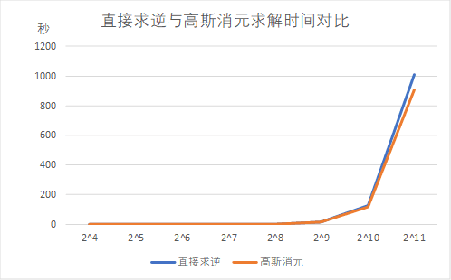
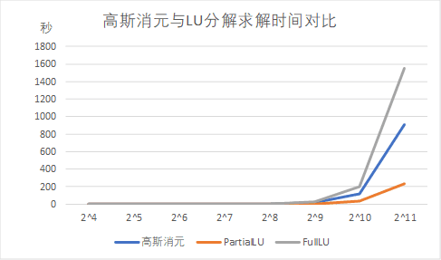

# 使用 C++ Eigen 库对几种常规解法进行性能分析

本阶段主要调研了 C++ *Eigen* 库提供的直接求逆法、高斯消元法、部分 LU 分解法、完全 LU 分解法、SVD 法求解稠密线性方程组的接口。

*Eigen* 是 C++ 语言里的一个开源模版库，支持线性代数运算，矩阵和矢量运算，数值分析及其相关的算法。它提供了对稠密矩阵的直接解法的方法，也提供了对稀疏矩阵的直接解法（Cholesky 分解法及其 LDL 变形、LU 分解法、QR 分解法）和迭代解法（共轭梯度法、共轭梯度最小二乘法、稳定双共轭梯度法）

*Eigen* 目前的非稳定版本还加入了 *CUDA 5.0* 作为一个[实验性的功能](https://eigen.tuxfamily.org/dox/TopicCUDA.html) (**experimental** feature)，目前还没有对这些解法和算子专门进行 CUDA 的优化。

## 结果汇总

我们对几种之前调研的、较为常用的几种稠密矩阵的直接解法进行了测试，并将数据总结如下：

| 高斯消元  |  2   |  4   |  8   |  16  |  32  |  64  | 128  |  256  |  512   |  1024  |  2048   |
| :-------: | :--: | :--: | :--: | :--: | :--: | :--: | :--: | :---: | :----: | :----: | :-----: |
| 直接求逆  |  1   |  1   |  1   |  3   |  9   |  55  | 439  | 2502  | 16930  | 127366 | 1009250 |
| 高斯消元  |  0   |  1   |  2   |  3   |  11  |  59  | 301  | 1966  | 15040  | 117485 | 910197  |
| PartialLU |  1   |  0   |  0   |  2   |  6   |  21  | 108  |  588  |  4158  | 31914  | 236163  |
|  FullLU   |  1   |  0   |  1   |  3   |  10  |  62  | 429  | 3238  | 25585  | 199875 | 1553150 |
|    SVD    |  2   |  3   |  18  |  97  | 412  | 1889 | 6731 | 31067 | 156456 | 917814 | 1650370 |

|   Solver   |     函数名      | 矩阵要求 | 速度（中小型矩阵） | 速度（大型矩阵） | 准确度 |
| :--------: | :-------------: | :------: | :----------------: | :--------------: | :----: |
| 直接求逆法 |    inverse()    |   可逆   |       ★★★☆☆        |      ★★☆☆☆       |  ★☆☆   |
| 高斯消元法 | householderQr() |    无    |       ★★★☆☆        |      ★★☆☆☆       |  ★☆☆   |
| PartialLU  | partialPivLu()  |   可逆   |       ★★★★☆        |      ★★★★☆       |  ★☆☆   |
|   FullLU   |   fullPivLu()   |    无    |       ★★★☆☆        |      ★☆☆☆☆       |  ★★★   |
|    SVD     |    bdcSvd()     |    无    |       ★☆☆☆☆        |      ★☆☆☆☆       |  ★★★   |

## 结果分析

### 直接求逆法和高斯消元法的对比

从上面的图表可以看出，线性方程组的直接求逆法与高斯消元法在相同大小系数矩阵的情况下，求解时间大致相等。从两种方法的求解过程来看，高斯消元法的消元过程将系数矩阵化为上三角矩阵，而回代过程从下往上依次求解所有未知数；而求解系数矩阵的逆，也是先将其化为三角矩阵，再从下往上消除对角元素外的非零元素。因此，直接求逆法和高斯消元法本质其实是类似的，两者计算量也是差不多的。

### 高斯消元法与LU分解法的对比

从上图可以看出高斯消元法和 LU 分解求解时间随矩阵大小的变化趋势是相似的，这是因为它们的时间复杂度为$O(n^{3})$，其计算时间都会随着矩阵纬度的增加而大幅度上涨。其中 PLUQ 的时间在不同维度下都要比 PLU 的时间要长。这是因为方阵 $A$ 的 PLU 分解是将它分解成一个置换矩阵 P、一个下三角矩阵 L 与上三角矩阵 $U$ 的乘积，即 $P^{-1}A=LU$ 其中 $P^{-1}$ 是在交换行的顺序；而将 A 分解成$A=PLUQ$，其中 $P$、$L$、$U$ 同上，$Q$ 是一个排列矩阵，即同时交换行与列的顺序，所以其算法执行时间要更长。

### LU分解法与SVD分解法的对比

- LU 分解法将系数阵 $A$ 直接分解成两个三角阵的乘积，根据矩阵运算的规则计算每个三角阵的元素。分解后线性方程组 $AX=b$ 的计算转化为两个三角形方程组的求解：

    - $LY=b $ （前推，计算出 $Y$）
    - $UX=Y$ （回代，计算出 $X$）

    其时间复杂度为 $O(\frac{2}{3} n^3+2n^2)$ 即 $O(n^3)$。

- svd 解法使用到两次矩阵乘法，其时间复杂度为 $O（n^3）$

## 下一阶段的计划

- 调研稀疏矩阵的Cholesky分解法、LU分解法和QR分解法，测试 Eigen 库提供的相关接口；
- 在上述结果的基础上思考这三种算法的并行加速思路。