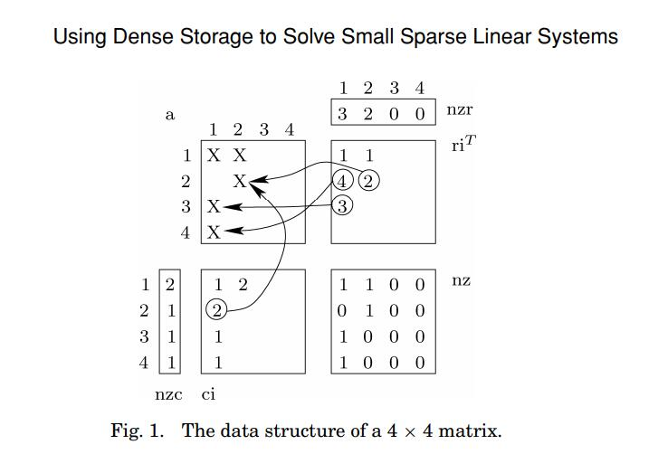
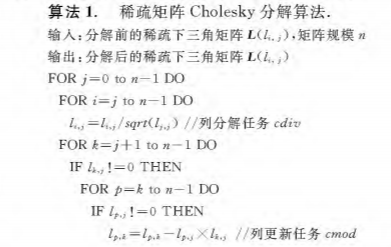
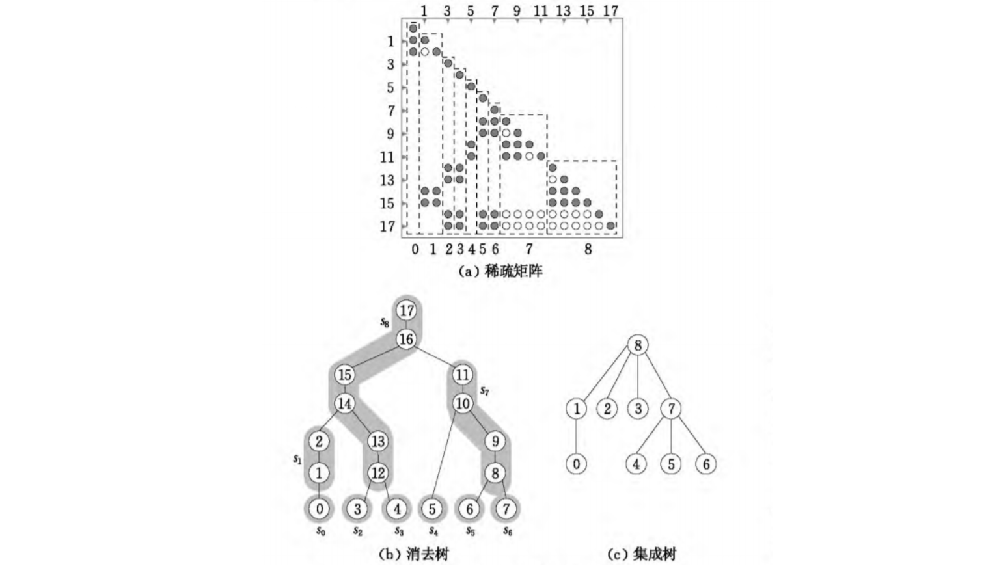
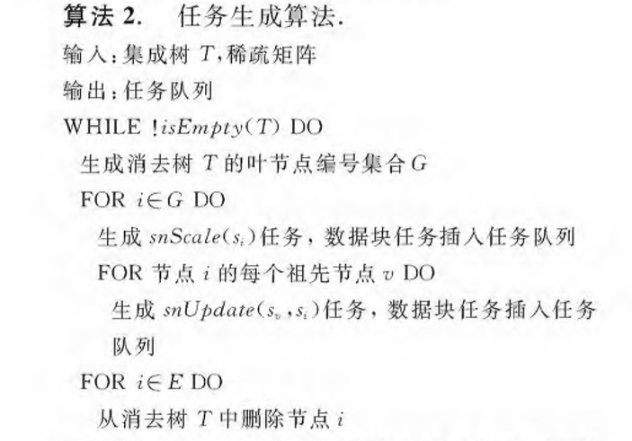
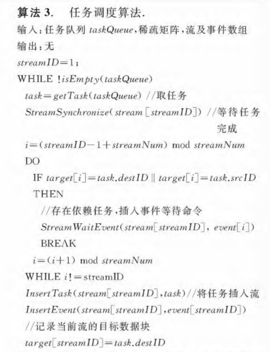

# 线性方程组直接解法相关论文研读

[TOC]

## A survey of direct methods for sparse linear systems

### 介绍

这篇综述由德州农工大学完成，它总结了稀疏矩阵直接解法的基本原理，涵盖了LU、QR、Cholesky和其他因子分解、正/反解以及相关的矩阵运算。它深入介绍了可用于解决稀疏矩阵问题的许多算法和软件，包括串行和并行算法。

本文的前十一节介绍了稀疏矩阵求解的数据结构、求解过程以及各种求解方法；而在第十二节中讨论了一些进阶的内容，其中就包括了**GPU并行加速**的一些研究成果。

### GPU-accelerated Multifrontal methods

近年来，针对稀疏矩阵的并行加速算法都是针对Frontal solver进行优化，采用一种被广泛使用的稀疏矩阵分解方法——**Multifrontal**方法。Multifrontal方法来源于高斯消元在有限元中的应用，具体的算法可以参考[这篇文章](https://zhuanlan.zhihu.com/p/36238727)。从高性能计算的角度来看，组装树中没有依赖的分支可以进行并行计算；此外，每个结点上的计算都是稠密矩阵计算，可以采用高度优化的稠密矩阵运算库进行计算。

本文介绍了从2009年到2016年相关算法的优化过程：

1. 2009 年 Pierce 等人在做 multifrontal Cholesky 分解时，将一个大的 frontal 矩阵传到 GPU 进行分解运算再传回 CPU，而小的 frontal 矩阵的运算仍在 CPU 上计算。
2. 2010 年至 2012 年间，不少研究发展了这个算法，主要体现在更有效地利用多CPU核心进行并行运算、将更多的 frontal 矩阵的更新计算移到 GPU 上，提出运行时调度框架（能够同时利用多 CPU 和多 GPU 的运算资源）等等。
3. 在 2014 年，Rennich 等人提出的方法让 GPU 能够同时处理多个超节点；同时分配 CPU 和 GPU 的大型超级节点的工作：CPU为较小的子代执行更新，GPU为较大的子代执行更新。
4. 在 2016 年，Hogg 等人提出一种调整主元 (pivoting) 的方法，frontal 矩阵是在 GPU 上组装的，而不是将它们带回 CPU 进行组装，这使得 GPU 能够有效地处理小的正面矩阵。
5. Sao 等人在 2014 年提出的基于 right-looking 的并行分布内存的 LU 分解算法将分解超级节点的工作留给 CPU 来完成，而将 GPU 上的小型密集矩阵更新聚合为较大的更新。
6. Yealan 等人在 2015 年提出了一种 multifrontal 稀疏 QR 分解方法将所有浮点工作都转移到 GPU 上完成，且frontal 矩阵的创建、组装和分解过程全部在 GPU 上完成，减少了异步计算和数据传输的开销。
7. Agullo 等人在 2014 年展示如何使用运行时系统在异构系统上有效地实现 multifrontal 稀疏 QR 分解方法。他们的方法依赖于多核心 CPU 和 GPU 来执行数值分解，他们提出了一种复杂的调度机制来解决多核 CPU 和 GPU 之间的数据依赖问题。

### 总结

总而言之，这些算法的发展同 GPU 性能的发展紧密相关，是在资源动态调配开销和并行计算优化之间的权衡，这些算法优化的方向大致总结如下：

1. 让 GPU (GPGPU) 承担更多的运算工作，即便执行的运算并非高度并行化的（早期的一种优化方案）；
2. 近年来如何通过 CPU+GPU 的异质计算来提升 Multifrontal 等方法的效率是研究的热点，但这会引入一个新的问题：GPU 所需的数据可能位于 CPU 上，并且执行每个任务的位置事先未知。
3. 调整主元 (pivoting) 等动态调度 (scheduling) 算法在解决异步性 (asynchrony) 问题方面非常有效，但 pivoting 带来的计算资源的动态分配会大大增加优化算法的难度，因此近年来相关算法的复杂度陡然提升；

## GPU-Accelerated Parallel Sparse LU Factorization Method for Fast Circuit Analysis

### 介绍

该文章于2016年发表于[IEEE Transactions on Very Large Scale Integration (VLSI) Systems](https://ieeexplore.ieee.org/xpl/RecentIssue.jsp?punumber=92)，它在GPU上提出了一种新的稀疏LU分解算法，比广泛使用的left-look的LU分解算法可以利用更多的并行性。在该篇文章中介绍了left-look算法以及所提出的新算法right-look的详细内容，并对新算法与现有的求解器进行了一系列的比对实验。

### Left-looking

算法描述：在每个步骤中，从左到右按列遍历矩阵来查看L和U左侧所有先前计算的列，从而来更新当前的计算列(同时包含L和U)，由于这种向左看的方式而得名left-looking。下面显示了伪代码与其示意图，在伪代码中假设当前列由$j$索引，而当前列左侧的列由$k$索引。为了计算当前列$j$，算法向左看，找到所有已经分解的列$k(k <j)$，其中$A_{sub}(k，j)≠0$，然后使用这些列更新当前列$j$。在该算法中k循环逐列更新是其关键步骤。

<div align="center">


</div>

优点：

1. 允许在实际数值计算之前对L和U矩阵进行符号填充分析
2. 可以实现两级并发
3. 实现上相对简单

缺点：

- 其中一个关键操作步骤——中间k循环逐列更新是串行的，会大大影响并行效率

### Right-looking

该算法的出发点是左眼算法，因为要保持列并发性和符号分析。但与左眼算法不同，一旦计算出L的列，它对尚未解决的列的影响将立即更新。下面显示了伪代码与其示意图，在伪代码中当前列由k索引，当前列右边的列由$j$索引。计算完当前列$k$之后，该算法将向右看并在子矩阵中找到所有列$j(j> k)$，其中$A_{sub}(k，j)≠0$，然后使用列k更新这些列。该算法中子矩阵的更新是其关键操作。

<div align="center">

</div>

优点：

1. 保持了left-looking算法的列并行性的优点
2. 将left-looking算法中的串行的关键操作改为了易于实现并行化的子矩阵更新，因为在算法的第三个循环中都是向量的MAD操作(加减乘除)，可以很方便地在gpu上实现。

### 实验

实验设计概要：

1. 在基准矩阵集、一般矩阵集、RLC网状网络生成矩阵集、UFL稀疏矩阵集合中的典型电路矩阵集上分别将right-looking gpu算法与其他算法的求解器进行比较，其中包括单线程和16线程的PARDISO，KLU，UMFPACK，GPU-LL。
2. 在不同的SM Warp Size(gpu 流处理器线程束的大小)下比对该算法的表现

实验结果：

1. 所提出的算法相比于单线程和16线程的PARDISO实现5.71和1.46的加速比，相比于KLU求解器19.56 加速比， 相比于UMFPACK求解器47.13的加速比，以及left-looking LU求解器1.47的加速比，证明了该方法相对于现有的稀疏LU解算器的优势。 
2. SM Warp Size设置为8能达到最佳的性能
3. 加速比很大程度上取决于基准矩阵的结构

## Using dense storage to solve sparse linear system

https://dl.acm.org/doi/pdf/10.1145/1206040.1206045

### 摘要

文中的数据结构课用于构建专门用于相对较小的稀疏系统的线性求解器。所提出的求解器针对运行时性能进行了优化（以占用内存为代价），优于具有100至3000个方程的系统的广泛使用的直接求解器和稀疏求解器。论文实验显示了求解器的多线程版本，可以更好地解决问题。
该数据机构对于非常稀疏的问题没有提升。

### 介绍

论文声称大部分的稀疏矩阵求解问题涉及的方程数量在 100 - 3000个。在多体模型（multi-body model）中， 这样小规模的方程求解会发生数千次，而引入有效的求解器能在不增加硬件复杂度的情况下提高模型的反应速度。

已有的研究缺陷在于可用的内存不够，有其他研究提出将非零元放到内存当中。还有一些针对于稠密矩阵的求解器，完全没有考虑内存的限制。

**传统的稠密矩阵的存储方式**

```c++
int n;
double **a;
int *nzr, *nzc;
int **ri, **ci;
char **nz;
```

$n$ 是矩阵（方阵维度），$a$ 用于存储矩阵元素，$row$ 是行， $col$ 是列， $a[row][col]$ 用于访问矩阵元素。$ri$ 和 $ci$ 存储非零元。$nzr$ 和 $nzc$ 用于统计 一行或一列非零元的个数。

**例子**



$nzr$ 和 $nzc$ 用于统计每行每列个数，元素具体位置由 $ci$ 和 $ri$ 一起组成。

**设置一个元素**

```c++
double* GetElementAddress(int row, int col) {
    if (!(nz[row][col])) {
    nz[row][col] = 1;
    ri[col][nzr[col]] = row;
    ci[row][nzc[row]] = col;
    nzr[col]++;
    nzc[row]++;
    a[row][col] = 0.;
}
return a[row] + col;
}


void CleanMatrix(void) {
    int i, k;
    for (i = 0; i < n; i++) {
        for (k = 0; k < nzc[i]; k++) {
            nz[i][ci[i][k]] = 0;
        }
    }
    memset(nzr, 0, sizeof(int)*n);
    memset(nzc, 0, sizeof(int)*n);
}
```

当矩阵被创建的时候， $nzr$ 和 $nzc$ 必须被初始化为 0 ，$nz$ 被初始化为`false` ,但是$a$ 不需要初始化，我们可以从其他结构中获取。

具有阈值 `部分枢轴` (partial pivot )的稀疏矩阵因式分解的实现很简单；数据结构允许算法循环
仅在非零元素上，从而大大减少了浮点数（这部分还没有完全看懂）
**操作：**

```c++
int piv[n];
void naivfct(int *piv) {
    char todo[n];
    int i, j, k, pvr;
    double den, mul;
    for (k = 0; k < n; k++) {
        todo[k] = 1;
    }
    for (i = 0; i < n; i++) {
        piv[i] = pvr = FindPiv(i, todo, 1.E-8);
        todo[pvr] = 0;
        den = 1.0/a[pvr][i];
        a[pvr][i] = den;
        for (k = 0; k < nzr[i]; k++) {
            if (!todo[ri[i][k]]) { continue; }
            mul = a[ri[i][k]][i]*den;
            a[ri[i][k]][i] = mul;
            for (j = 0; j < nzc[pvr]; j++) {
                if (ci[pvr][j] <= i) { continue; }
                *GetElementAddress(ri[i][k], ci[pvr][j]) − = mul*a[pvr][ci[pvr][j]];
            }
        }
    }
}
```

 `piv` 向量在计算的过程中保存;  `FindPiv` 函数用于寻找还没有被计算到的位置。

```c++
int FindPiv(int i, char *todo, double minpiv) {
    int k, pvr, nc;
    double mul, mulpiv, fari;
    nc = n+1;
    pvr = ri[i][0];
    mul = 0.;
    for (k = 0; k < nzr[i]; k++) {
        if (todo[ri[i][k]]) {
            fari = fabs(a[ri[i][k]][i]);
            if (fari > mul) {
                mul = fari;
            }
        }
    }

//完成最后的计算
mulpiv = mul*minpiv;
for (k = 0; k < nzr[i]; k++) {
    if (todo[ri[i][k]]) {
        fari = fabs(a[ri[i][k]][i]);
        if (fari >= mulpiv && nzc[ri[i][k]] < nc) {
            nc = nzc[ri[i][k]];
            pvr = ri[i][k];
        }
    }
}
    return pvr;
}
```

论文还提供了该库的细粒度多线程版本。所有的线程进入LU分解的外循环；然后一个线程搜索枢轴行，而其他线程等待。当第一个线程找到枢轴行，所有线程进入第二个内部循环，然后处理
不同的行。为了避免高速缓存未命中，重要的是静态分配每个行到单线程；这可以通过根据row％ncpu预先分配工作行来完成。列自旋锁用于保护nzr和
ri在最内层的循环中，需要将新的非零元素添加到矩阵。不需要其他锁，因为每个线程一次都可以分解一个不同的行。此外，缓存未命中应减少到最小值，因为如前所述，给定行的条目是静态的分配给单个cpu，并连续存储在内存中
在其最内层的循环中由单个线程访问，所有线程在两个内部循环的末尾同步。

## Cholesky 分解相关论文研究

Cholesky 分解根据矩阵的应用及存储特性可以分为稠密矩阵和稀疏矩阵的 Cholesky 分解，两种方式的分解都有者广泛的应用和研究，且都希望通过并行化的方法来获得高性能。以稠密矩阵运算为代表的具有规则的访存和计算特性的并行算法易于在 GPU 上获得高于通用处理器的计算性能。然而，以稀疏矩阵 Cholesky 分解为代表的具有不规则的访存和计算特性的并行算法在 GPU 上的计算效率很低，大量离散数据访问和分支计算使得 GPU 的线程串行化执行，无法发挥 GPU 的并行化优势，这种情况下 GPU 的实际性能往往低于多核 CPU，为了在 GPU 上高效实现稀疏矩阵 Cholesky 分解，需要从数据组织和计算调度两方面对现有算法重新设计。我们首先寻找了一些关于稀疏矩阵 Cholesky 分解的论文：

- 论文 “Design of a multi core sparse Cholesky factorization using DAGs” 采用有向无环图方法，将分解任务分解到多核处理器上执行，采用的实现平台为 Fortran 95 和 OpenMP，因此该方法仅适用于 CPU；
- 针对无法一次装入内存的大规模稀疏矩阵，论文 “An out-of-core sparse Cholesky solver” 设计实现了 Out-of-Core 形式的 Cholesky 求解器，该方法主要应用于三维网格分析和集成电路仿真等大规模复杂问题；
- 论文 “**基于 GPU 的稀疏矩阵 Cholesky 分解**” 则从优化稀疏矩阵的数据结构和计算调度两方面出发，在满足数据依赖性的前提下提高任务的并行性。

由于我们本学期主要研究的是基于 GPU 的加速方法，所以我们对第三篇论文进行了进一步的研究与探讨。

### 稀疏矩阵 Cholesky 分解法

该论文中使用的稀疏矩阵 Cholesky 分解法与一般的分解算法有所不同，该算法将对称正定稀疏矩阵 $A$ 分解为 $LL^{T}$，其中 $L$ 是对角元素为正的下三角矩阵。由于 $A$ 为对称矩阵，只需要存储和处理矩阵 $A$ 的下三角部分的非零元素，$L$ 的数指直接覆盖矩阵 $A$ 的下三角部分，稀疏矩阵 Cholesky 分解算法按照从左到右的顺序更新 $L$，为了便于描述计算过程，该算法定义了两类计算任务：列分解任务 $cdiv$ 和列更新任务$cmod$，其中，$cdiv(k)$ 对第 $k$ 列进行分解，$cmod(k,j)$ 使用第 $j$ 列更新第 $k$ 列。该算法可表示为一系列的计算任务：按照从左至右的顺序，首先生成 $cdiv(j)$ 任务，对当前列 $j$ 进行分解；然后生成 $cmod(j+1:n, j)$ 任务，使用当前列 $j$ 更新右侧所有相关列。在分解过程中，矩阵 $A$ 中的一部分零元素会转变为非零元素，这种元素称为填充元。该算法的伪代码如下：



### 数据组织

论文改进了面向 GPU 的稀疏矩阵数据组织方法，通过将稀疏矩阵稀疏结构相似的列合并成超节点后再进行数据分块，使得计算任务处理的对象由不规则的稀疏列转换为了规则的稠密数据块，通过将矩阵数据存储在 GPU 端，所用和控制数据存储在 CPU 端，降低了 CPU 与 GPU 的通信开销。

- 超节点生成：基于列将稀疏矩阵组织成一系列规则的数据块，合并相邻的稀疏结构相同的矩阵列，合并规则如下：
    $$
    \operatorname{merge}\left(c_{i}, c_{i+1}\right) \text { iff }\left\{\begin{array}{l}
    i+1=\text {parent }(i) \\
    \operatorname{nnz}(i)=n n z(i+1)+1
    \end{array}\right.
    $$
    其中，$c_i$ 表示第 $i$ 列，$parent(i)$ 表示消去树中节点 $i$ 的父节点编号，$nnz(i)$ 表示第 $i$ 列中对角线下方的非零元素。列合并后，稀疏矩阵被划分为一系列超节点，消去树中各节点合并后形成新的树结构，称为集成树。

    

- 超节点的合并：大多数超节点的宽度（合并的列数量）较小，相应的计算任务处理的矩阵规模也较小，直接将这些计算任务映射到GPU上无法充分发挥GPU的高带宽和高并行计算性能的优势，因此需要将一些稀疏结构相近的相邻超节点进一步合并，通过增加超节点的宽度以增大计算任务的粒度。为了区分合并前后的超节点，论文将合并前的超节点称为基本超节点，合并后的超节点称为扩展超节点。具体合并方法为：
    $$
    \operatorname{merge}\left(s_{i}, s_{i+1}\right) \text { iff }\left\{\begin{array}{l}
    i+1=\text { parent }(i) \\
    \text { width }\left(s_{i}\right)<t \\
    \text { width }\left(s_{i+1}\right)<t
    \end{array}\right.
    $$
    其中，$s_{i}$ 表示第 $i$ 个基本超节点，$parent(i)$ 表示集成树中节点 $i$ 的父节点编号，$width(s)$ 表示基本超节点 $s$ 的宽度，$t$ 为合并阈值，宽度小于 $t$ 的相邻父子基本超节点将被合并为扩展超节点。

- 超节点分块：矩阵数据按照块列顺序逐块存储，块内数据逐行存储。在基本超节点数据结构的基础上，增加了指向块列元素起始地址的 $blkColPtr$ 数组，而 $snPtr$ 数组指向扩展超节点对应
    的 $blkColPtr$ 数组的起始位置。

### 任务生成与调度方法

论文设计了基于队列的任务生成与调度方法，计算任务在集成树的指导下生成并加入任务队列，在同一个时间内，可以有多个 GPU 任务同时执行，这些任务间的并行是通过流机制实现的，而任务间的数据依赖性则是通过事件同步机制进行控制，通过流并行以及事件同步机制，在保证计算正确性的前提下提高计算效率。

<table>
        <tr>
            <td>
                
            </td>
            <td>
                
            </td>
        </tr>
    </table>

### 实验结果

在双精度条件下，论文获得了相对于4核处理器 2.69～3.88 倍的加速比。据我们所调查的论文来看，这是稀疏矩阵Cholesky分解算法在GPU平台上获得的相对多核通用 CPU 平台的较高加速比。

## 总结与下一步的计划

经过一周时间的文献调查，我们了解到了稀疏矩阵的直接解法的一些实现方式以及加速方法；我们发现稀疏矩阵解法中也有不少可并行性可以挖掘，并利用 GPU 进行加速；同时我们也发现大多数优化算法高度依赖于比如指令集、缓存大小等底层硬件信息，因此我们可以考虑使用 CUDA 运算库的形式进行实现。

我们下一步的计划则是尝试使用实验室的设备使用 *cuSPARSE*, *cuSOLVER* 等库对上述算法进行实现，并测试其性能。