# 三种直接解法的CPU和GPU版本性能对比

[TOC]

## 1 LU分解法

### 1.1 实验内容

$$
\left\{\begin{array}{l}\boldsymbol{L} \boldsymbol{y}=\boldsymbol{b} \\ \boldsymbol{U} \boldsymbol{x}=\boldsymbol{y}\end{array}\right.
$$

1. 使用C实现right-looking算法以及LU分解后的$\boldsymbol{y},\boldsymbol{x}$的求解的CPU版本
2. 使用CUDA实现right-looking算法以及LU分解后的$\boldsymbol{y},\boldsymbol{x}$的求解的并行GPU版本（加速思路在之前的报告中有详细说明，具体实现方式没有用到新的技巧，所以就不在报告中阐述了）
3. 在不同维度以及单双精度下所生成的随机可逆矩阵，对GPU和CPU版本算法进行对比测试
4. 记录测试数据，分析测试结果

### 1.2 实验结果与分析

#### 1.2.1 精度分析

- 在实验过程中，在小维度下所得到的GPU版本和CPU版本计算结果间的误差范围基本小于0.01，基本保证了GPU算法实现的正确性。但在不断提高维度的过程中，由于GPU版本在每次迭代中都会有误差，而维度越大则迭代次数越多，迭代所造成的累积误差越来越严重，最终导致计算结果与CPU版本有严重误差（甚至达到inf）。
- 在单精度下GPU版本中一开始迭代的那些列中里CPU和GPU的结果基本保持在6位数精度范围内相等，因为单精度float的精度差不多是6-7位。
- 在单精度下GPU的加速比要大于双精度，同时其计算结果于CPU相比误差也更大，因为双精度double的精度范围16位左右。

造成精度误差的可能原因：

1. 生成的随机可逆矩阵不能进行LU分解
2. 在LU分解前没有进行行初等变换（即$PLU$）
3. 迭代所造成的累积误差

#### 1.2.2 性能分析

<table>
    <tr>
        <td>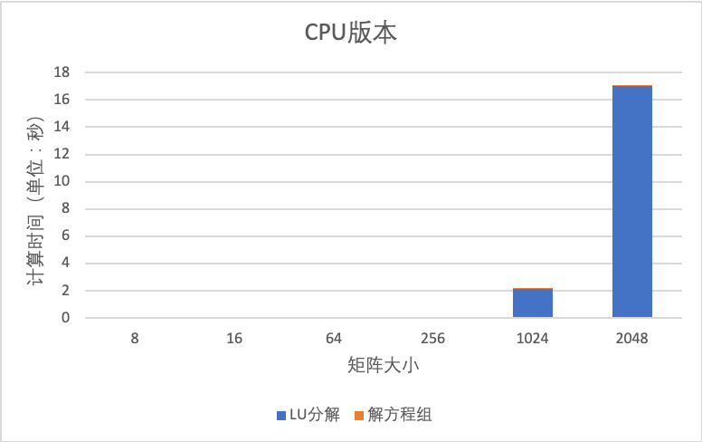</td>
        <td>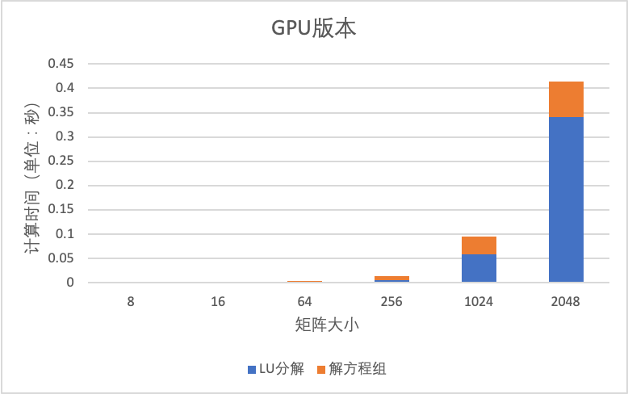</td>
    </tr>
</table>

    Figure 1. LU分解法中CPU和GPU版本中矩阵分解和解方程组两部分的执行时间

<table>
    <tr>
        <td>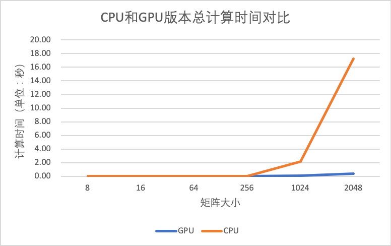</td>
        <td>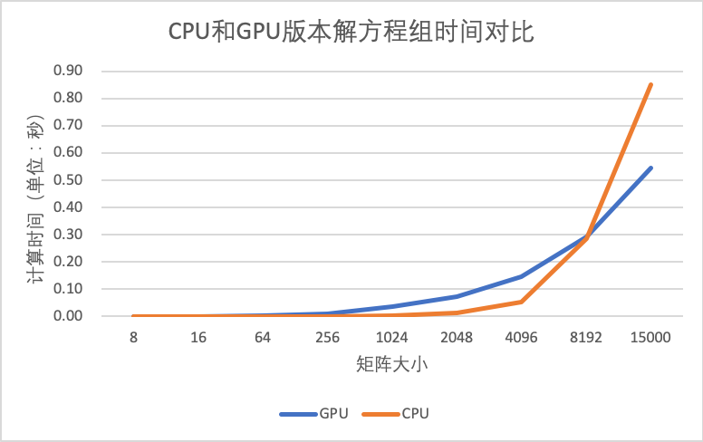</td>
    </tr>
</table>

    Figure 2. LU分解法中CPU和GPU版本总计算时间和解方程组（即不考虑矩阵分解）所用时间的对比

结果分析：

1. LU分解计算复杂度$\mathrm{O}\left(\mathrm{n}^{\wedge} 3\right)$，在GPU版的每轮迭代中，一个block负责subMatrix中一行的更新，而一个block包含了1024个thread，所以并行性已经很高了，而且算法本身的计算复杂度是很高的，所以能够获得较高的加速比。
2. $\boldsymbol{y},\boldsymbol{x}$的求解复杂度$\mathrm{O}\left(\mathrm{n}^{\wedge} 2\right)$，在求解过程中数据间关联较高且有大量的规约操作，导致GPU实现的版本加速效果不明显。

### 1.3 实验环境

#### 1.3.1 硬件环境

- **CPU:** Intel(R) Xeon(R) CPU E5-2650 v4 @ 2.20GHz（12核）
- **GPU:** NVIDIA Tesla K40c (11G)

#### 1.3.2 软件环境

- Nvidia Cuda 8.0.61

#### 1.3.3 运行环境

- 命令行 通过nvcc编译代码

### 1.4 实验改进

1. 使用matlab或者C/C++的库生成可一定能LU分解的可逆矩阵，看看精度误差是否依旧严重
2. 算法上解决精度误差问题：超出能力范围，且没有思路

## 2 Cholesky 分解

### 2.1 实验内容

Cholesky 分解是把一个对称正定的矩阵表示成一个下三角矩阵L和其转置的乘积的分解。它要求矩阵的所有特征值必须大于零，故分解的下三角的对角元也是大于零的。
$$
A=LL^{T}
$$

1. 使用 C++ 实现 Cholesky 分解算法并进行线性方程组求解；
2. 使用 CUDA 实现 Cholesky 分解算法及利用分解结果求解线性方程组的并行 GPU 版本；
3. 随机生成不同维度的正定矩阵，对 CPU 和 GPU 版本算法进行对比测试（由于设备内存限制，测量的最大矩阵维度为2048）；
4. 记录测试数据，分析测试结果。

### 2.2 实验结果与分析

- CPU 与 GPU 版本下 Cholesky 分解和解方程组时间占比分析

  <table>
          <tr>
              <td>
                  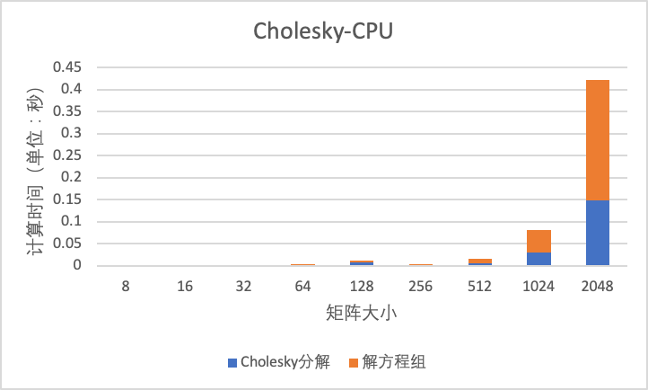
              </td>
              <td>
                  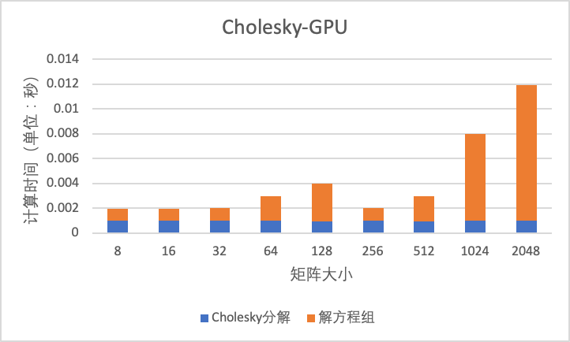
              </td>
          </tr>
  </table>
  

      Figure 3. Cholesky分解法中CPU和GPU版本中矩阵分解和解方程组两部分的执行时间
  

  - 串行执行的 Cholesky 分解和解方程组的时间复杂度都为 $O(n^{3})$，随着矩阵维度增加，求解方程组的时间占比越来越大；
  - 利用 CUDA 实现的 Cholesky 分解和并行执行的解方程组的时间随着矩阵维度增大，时间增幅比 CPU 版本小得多，另外，求解方程组在实现 GPU 并行版本后，求解时间随矩阵维度增加变化不大，Cholesky 分解则还是有一定程度的时间开销增长。

- CPU 与 GPU 版本加速比分析

  <table>
          <tr>
              <td>
                  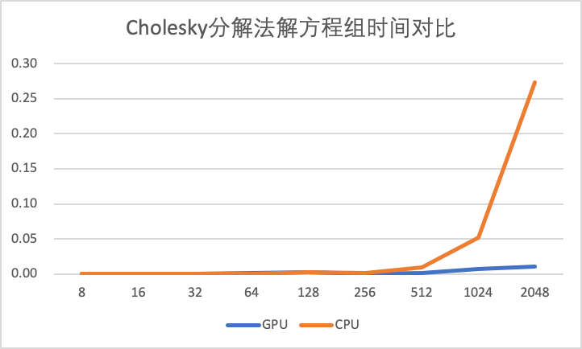
              </td>
              <td>
                  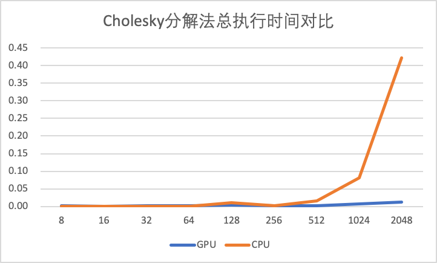
              </td>
          </tr>
  </table>

      Figure 4. Cholesky分解法中CPU和GPU版本总计算时间和解方程组（即不考虑矩阵分解）所用时间的对比
  

  
  
  - 当矩阵维度较小时，时间开销非常小，因此对其求加速比没有意义；
  - 当矩阵维度较大时，矩阵维度越大，GPU 加速效果越好，目前设备能测试的最大矩阵维度 2048对应的加速比为35.2倍。

## 3 SVD 分解

### 3.1 实验内容

SVD是对矩阵进行分解，但是和特征分解不同，SVD并不要求要分解的矩阵为方阵。假设我们的矩阵A是一个m×n的矩阵，那么我们定义矩阵A的SVD为：

$$
A=U \Sigma V^T
$$
其中U是一个 $m×m$ 的矩阵，$\Sigma$是一个 $m×n$ 的矩阵，除了主对角线上的元素以外全为0，主对角线上的每个元素都称为奇异值，V是一个$n×n$的矩阵。U和V满足 $U^TU=I,V^TV=IU^TU=I,V^TV=I$。

1. 使用 C++ 实现 SVD 分解算法并进行线性方程组求解；
2. 使用 CUDA 实现 SVD 分解算法及利用分解结果求解线性方程组的最小二乘解并行 GPU 版本；
3. 随机生成不同维度的正定矩阵，对 CPU 和 GPU 版本算法进行对比测试（由于设备内存限制，测量的最大矩阵维度为2048）；
4. 记录测试数据，分析测试结果。

### 3.2 实验结果与分析

- CPU 与 GPU 版本下SVD 分解和解方程组时间占比分析

  <table>
          <tr>
              <td>
                  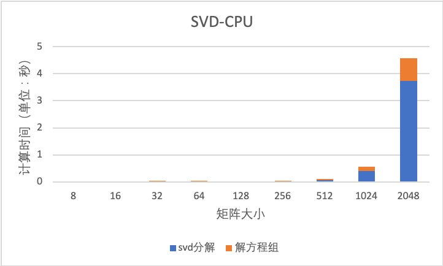
              </td>
              <td>
                  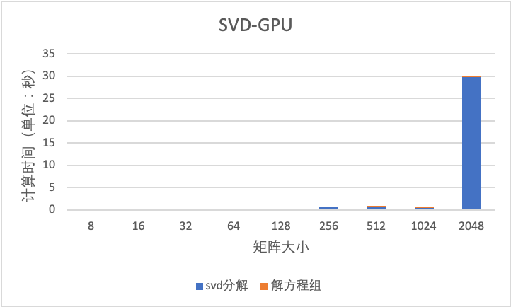
              </td>
          </tr>
  </table>
  
  

      Figure 5. SVD分解法中CPU和GPU版本中矩阵分解和解方程组两部分的执行时间
  

  - 串行执行的 Cholesky 分解和解方程组的时间复杂度都为 $O(n^{3})$，随着矩阵维度增加，求解方程组始终只占总的时间的很小一部分。

  - 然而很奇怪的是CPU版本的SVD分解的花费时间明显少于GPU版本，可能在4096以后会有不同的结果，由于硬件设置无法进行进一步实验。

- CPU 与 GPU 版本加速比分析

  <table>
          <tr>
              <td>
                  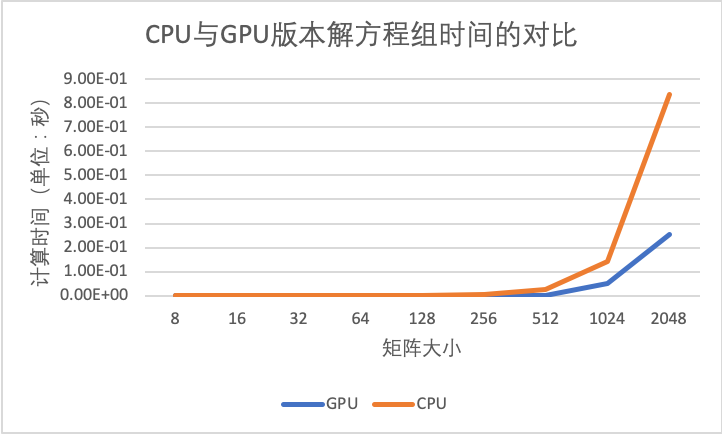
              </td>
              <td>
                  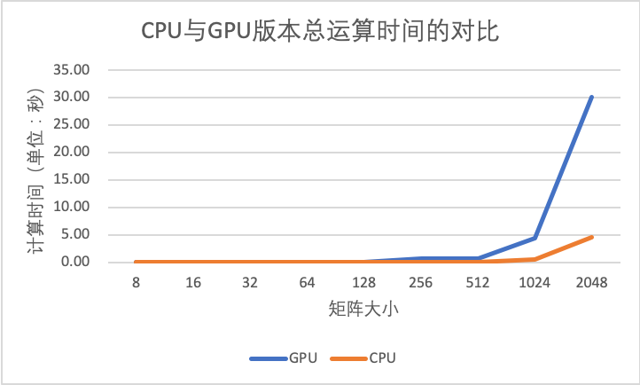
              </td>
          </tr>
  </table>

      Figure 6. SVD分解法中CPU和GPU版本总计算时间和解方程组（即不考虑矩阵分解）所用时间的对比
  

  
  - 当矩阵维度较小时，时间开销非常小，因此对其求加速比没有意义；
  - 由于前面所提到的结果GPU版本相对于CPU并没有加速，主要慢在了SVD分解的过程，猜测是cuda自带的svd分解速度慢或者在设置上有区别，也可能和随机矩阵生成方式有关，我们会在接下来的实验中继续研究

